  

   
   

  
  
  

 

Sou desenvolvedor full stack. Construo APIs, modelo dados e crio interfaces responsivas, com atenção a código limpo e à experiência de quem usa o produto. Hoje trabalho com Node.js, Vue, React e Go; também desenvolvo projetos com Java.

  

 

## 02 / Projetos em destaque

<table>
  <tr>
    <td width="50%" valign="top">
      <h3>Nozzle Lab</h3>
      
Gestão para negócios de impressão 3D: pedidos, clientes, estoque, impressoras e despesas em um só lugar.

      
<code>React</code> <code>NestJS</code> <code>TypeScript</code> <code>PostgreSQL</code> <code>Docker</code>

      <a href="https://nozzle-qmu.pages.dev">Ver projeto ↗</a>
    </td>
    <td width="50%" valign="top">
      <h3>Dra. Milena Takenaka</h3>
      
Site institucional para consultório odontológico, responsivo e com foco direto no agendamento de consultas.

      
<code>Vue 3</code> <code>TypeScript</code> <code>Node.js</code> <code>Tailwind CSS</code> <code>Docker</code>

      <a href="https://dramilenatakenaka.com">Ver projeto ↗</a>
    </td>
  </tr>
</table>

<a href="https://diegorebua.com/projetos">Ver mais projetos no portfólio →</a>

